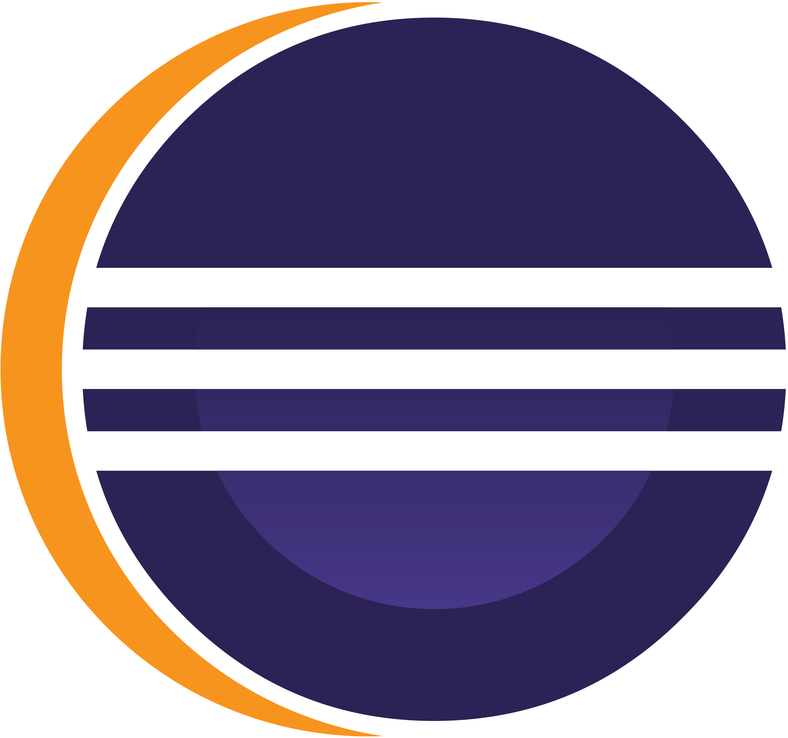

 
 

    
    
     
     
     
     
     
     
    

 

 

    
    

### 𝖨'𝗆 𝖺 Coding Newbie 𝖿𝗋𝗈𝗆 India, 𝗅𝗈𝗈𝗄𝗂𝗇𝗀 𝖿𝗈𝗋𝗐𝖺𝗋𝖽 𝗍𝗈 𝖾𝗆𝖾𝗋𝗀ing 𝖺𝗌 𝖺 **𝖥𝗎𝗅𝗅𝗌𝗍𝖺𝖼𝗄 𝖣𝖾𝗏𝖾𝗅𝗈𝗉𝖾𝗋**.

- 🏢 Currently pursuing MBA at Sinhagad Technical Education Society's Smt. Kashibai Navle College of Engineering, Pune.
- 🎓 Completed my Bachelors in Information Technology from Sipna Collge of Engineering and Technology, Amravati.
- 🏫 Went to Government Polytechnic, Amravati for Diploma in Computer Engineering.

  > 𝙸'𝚖 𝚊 𝚙𝚊𝚜𝚜𝚒𝚘𝚗𝚊𝚝𝚎 𝚍𝚎𝚟𝚎𝚕𝚘𝚙𝚎𝚛, 𝚠𝚊𝚗𝚝 𝚝𝚘 learn as much I can, 𝚊𝚗𝚍 𝚖𝚊𝚔𝚎 𝚏𝚛𝚒𝚎𝚗𝚍𝚜 𝚠𝚑𝚒𝚕𝚎 𝚍𝚘𝚒𝚗𝚐 𝚜𝚘! 😇

 
 

 

    
    

### 𝖨'𝗆 𝖿𝗈𝖼𝗎𝗌𝗂𝗇𝗀 𝗈𝗇 𝗂𝗇𝖼𝗋𝖾𝖺𝗌𝗂𝗇𝗀 𝗆𝗒 𝗄𝗇𝗈𝗐𝗅𝖾𝖽𝗀𝖾 𝗂𝗇 𝗍𝖾𝖼𝗁𝗇𝗈𝗅𝗈𝗀𝗂𝖾𝗌 𝗂𝗇𝗏𝗈𝗅𝗏𝗂𝗇𝗀 *𝖥𝗎𝗅𝗅𝗌𝗍𝖺𝖼𝗄 𝖣𝖾𝗏𝖾𝗅𝗈𝗉𝗆𝖾𝗇𝗍*.

### ⚙️ *Frontend Technology*
 

<!-- html -->
  

<!-- CSS -->
  

<!-- Bootstrap -->
  

### ⌨️ *Programming Languages*
 

<!-- JavaScript -->
  

  <!-- Java -->
  

 <!-- PHP -->
  
  
  

   

  ### 🗄️ *Framework*
   
  

    <!-- React -->
      

 

  

 ### 🫙 *Database*

  

 

  <!-- MySQL -->
  

  

   

  ### 🛠️ *Tools*

   

  

   <!-- Visual Studio Code -->
  

   <!-- Eclipse -->
  

  

   

   

 

    
    

- [x] ☕ Programming while drinking *Cold Coffee* is life saving. 
- [x] 📖 Reading is my hobbie and can never get bore of it.
- [x] 🌲 I enjoy nature a lot. 
- [x] 📸 Have a knack for *Photography*.
- [x] 🍿 Sucker for Horror movies.

 

 

    
    

  
  
   

  

   

  
 I'll be waiting for&nbsp; <b>Hie</b>&nbsp;&nbsp;&nbsp;^_+

 

  

      
  

 <b>*Annyeong!!!👋*</b>

